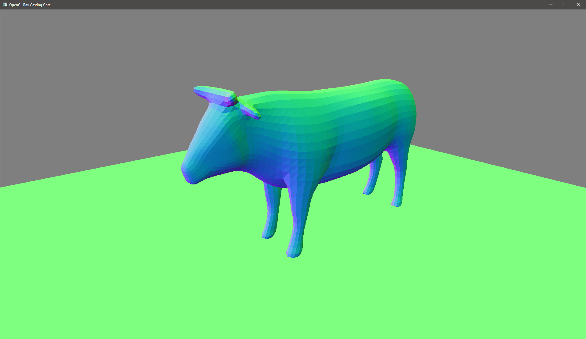
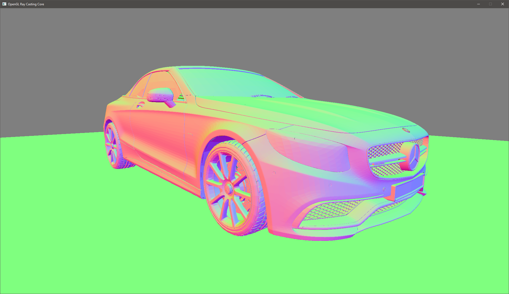

# OpenGL Ray Casting Core
This is my old project for ray tracing in GPU. For more compatibility, I used OpenGL. Origin project use Python and OpenGL 4.4, but I redid the project to C++ and OpenGL 3.3( If you remove the VAO it works at 3.0 or 2.X). This is simple example, how to create simple BVH tree for triangle mesh, and travel BVH in GPU with program stack. I try create API look like OptiX.

**Sceen shots**

Using  ray casting for visualization object with normal:

**Use libs:**
- [SDL2]
- [GLM]
- [glad]

[GLM]:  <https://github.com/g-truc/glm>
[glad]: <https://github.com/Dav1dde/glad>
[SDL2]: <https://www.libsdl.org/download-2.0.php>

**FPS camera control**

wasdqe - for move
- w - front
- s - back
- a - left
- d - right
- q - up
- e - down
